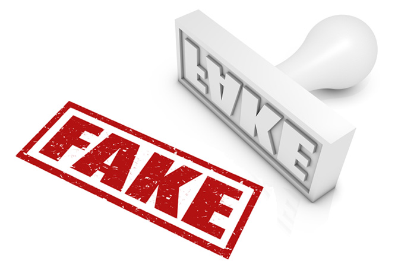

##

{width=1500px}

##
##

# **Welcome!** 

##
##
##

#### For our final project, we tried to analysis the various aspects of the dataset we chose to work on. Our analysis is about the numerous fake news published and spread in the year 2016. The purpose behind choosing to work on this topic is to make people aware of the numerous fake news that are revolving around them.

##
##
##

#### The fake news dataset is important because of the massive hysteria revolving around what news is reliable, whether or not popular news sites are from hate groups, and whether or not news sites are funded by foreign interests. This analysis cater to the needs of those people who want to know more about popular and extremely biased news sources or about the fake news that was in the air in the past.

##
##
##

#### We have categorized our analysis in two types:
1. Static Analysis - Some graphs which have been developed after analyzing the dataset beforehand
+ Pie chart showing the ratio of fake news spread or produced in various countries.
+ Bar graph which delineates the various categories of news and the number of news articles of each category.
+ Horizontal bar graph shows the authors who have published more than 50 fake news articles and the number of articles by each author.
+ Pie chart which shows and compares the number of articles published or translated from languages other than English.

2. Dynamic Analysis - Giving the audience a chance to find what they want to lookup
+ In the first tool,  the users can type a word in the search and can find how many articles contain that word
+ In the second tool, the users can look up various fake news articles and can read about them in detail. This tool has features through which the users can 
even filter their search according to author, language, type of news as well.
+ In the third tool, ....

##
##
##

#### We hope that you will get a lot of information about fake news from our analysis and believe that you will enjoy using our website! 

#### Please help us improve with your suggestions and ideas. We would be more than happy to incorporate your suggestions in our Fake News Analyzer.

#### Thank You!!!! :)