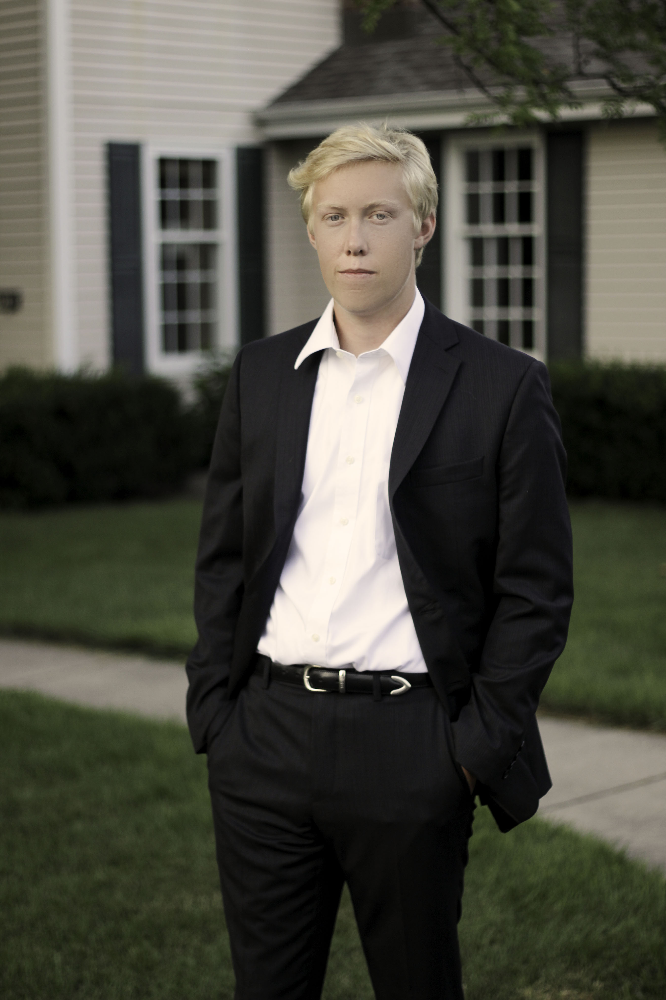

##
##
##

{width=1500px}

##
##
##

#### Now to unveil the curtain and meet the faces behind the work that went into this project.

##

### Hayden Hong

##

##### 

### Mrinoy Banerjee

{width=200px}

##

#####

### Saksham Aggarwal

{width=200px}

##
##

##### Saksham is a sophomore majoring in Mathematics and intending to get into Computer Science. He loves to watch horror movies. He spends a lot of time learning different programming languages but also loves to explore new places and try different food. One fact about him is that he started a community service organization back in high school and developed a website for it. The website URL is gather2share.org

### Will Bowers

{width=150px}

##### 

